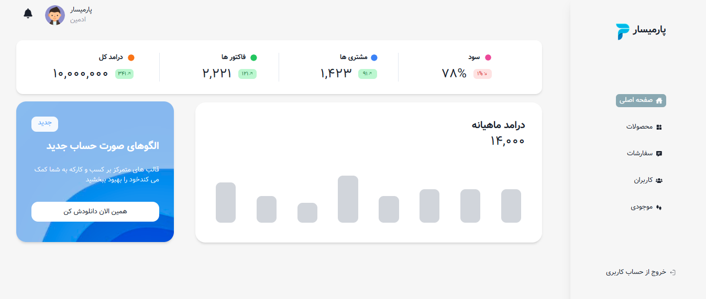
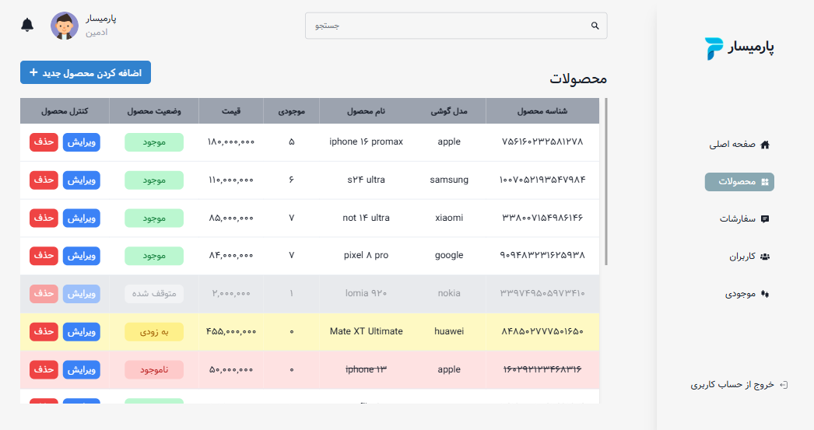
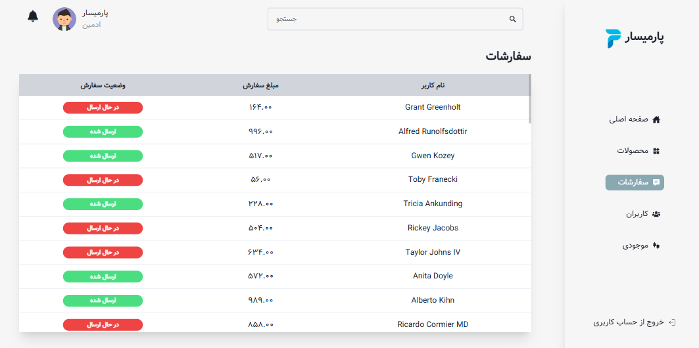

# Parmisar Phone Admin

Parmisar Phone Admin is a comprehensive mobile application that provides handling administrative tasks efficiently.

## ✨ Key Features

- authentication factor
- Role-based access control
- Device inventory tracking
- Repair status monitoring
- Customer information management
- Performance metrics
- Service statistics
- User activity monitoring
- Real-time service updates
- System alerts

## Screenshots






## 🚀 Getting Started

1. **Clone the repository**

   ```bash
   git clone https://github.com/Parisa-Esmaeilpour1993/Parmisar_Phone.git
   ```

2. **Navigate to project directory**

   ```bash
   cd Parmisar_Phone
   ```

3. **Install dependencies**

   ```bash
   npm install
   ```

4. **Run the application**
   ```bash
   npm run dev
   ```
